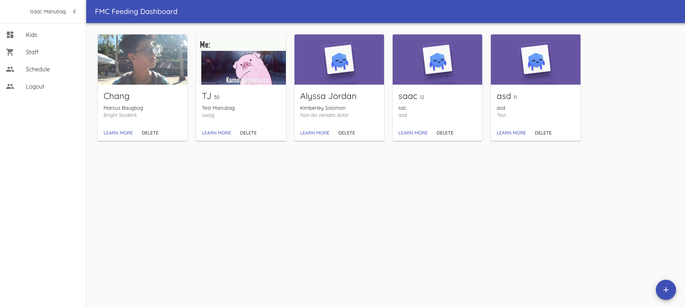
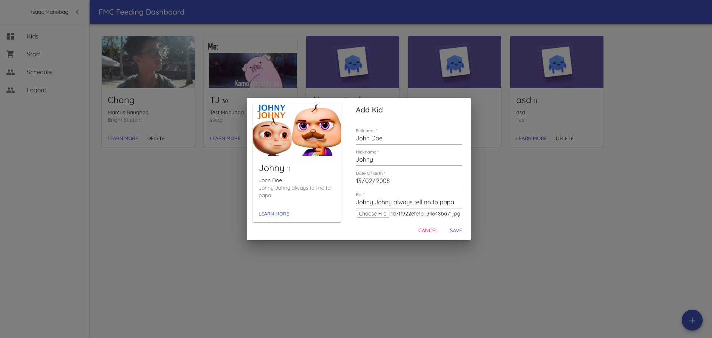
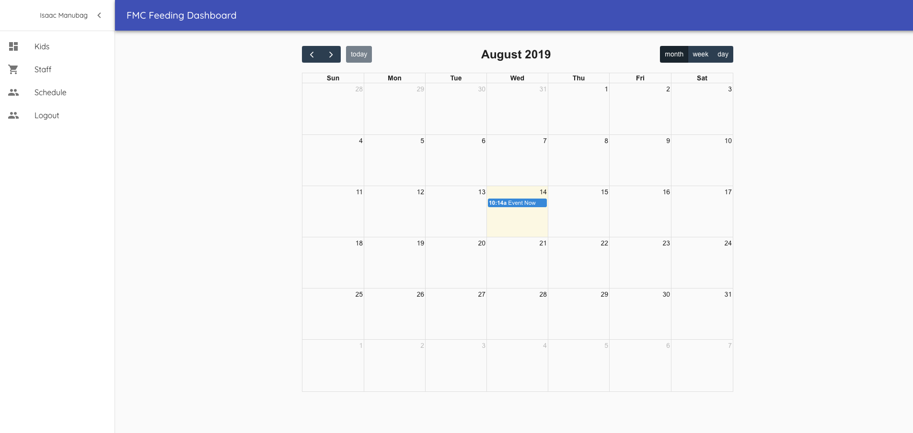

# FMC Cebu Kids/Feeding Database
[Open Website](https://fmc-cebu-feeding.firebaseapp.com/)

This project aims to store the list of kids who has attended the FMC Cebu Feeding Program.
Primary functions are:
 - Store Information of the kids on firebase firestore db
 - Create feeding program schedules via fullcalendar widget
 - Create an attendance record for each feeding program and who has attended it
 - Implement rules on who can do CRUD operations

### Installation

```sh
$ npm install
```


### Todos

 - Write Tests
 - Add face detection for kids for automated attendance records (this one is quite a long shot :))

License
----

MIT


##### Technology Stack Used
 - ReactJS
 - React Redux
 - Material UI
 - Firebase Functions
 - Firebase Firestore
 - Firebase Admin SDK

 # Screenshots




